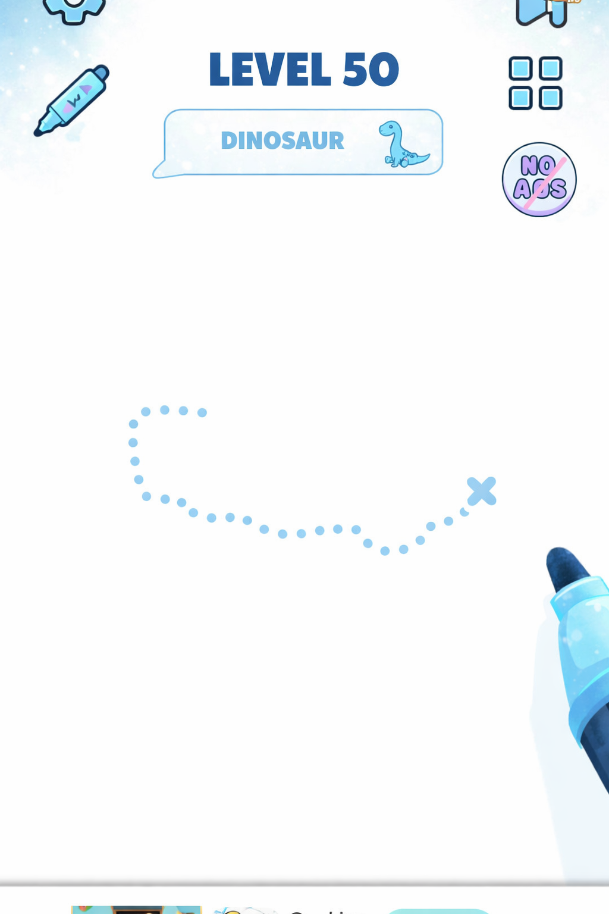
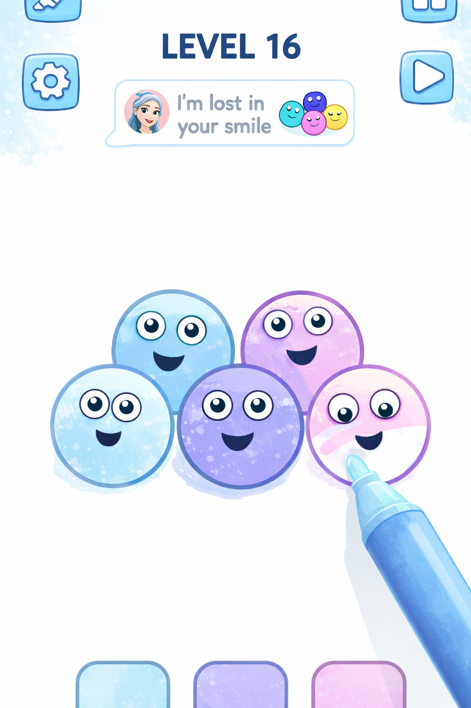

# 🎨 Duti Draw — Chi tiết tính năng (Feature Specification)

Tài liệu mô tả **tính năng chi tiết** cho Duti Draw, đồng bộ với:
- `SYSTEM_DESIGN.md` (scope + kiến trúc + stack)
- `UI_Component_System.md` (token + layout gameplay tham chiếu `docs/demo_layout_*`)
- `Audio_Design_Specification.md` (BGM/SFX + debounce)

> **Mục tiêu sản phẩm:** ứng dụng tô màu thư giãn, fantasy “Magical Candy Winter”, đa nền tảng (Mobile/Web/Tablet).

---

## Tóm tắt gameplay (core loop)

Đây là **mô tả nghiệp vụ chính** mà sản phẩm hướng tới (tracing → tô màu theo vùng):

- **Khởi đầu:** **20 level** — **mỗi level tương ứng 1 con vật** (có thể mở rộng thêm level / pack sau).
- **Mỗi level gồm 2 phần:**
  - **Phần 1 — Tracing (tạo khung viền):** Người chơi **nhấn giữ**; **cây bút** vẽ **viền** theo **đường guide dạng chấm (`...`)** để tạo **khung hình** con vật. Khi vẽ xong toàn bộ path → **ấn Tiếp tục** để vào phần 2.
  - **Phần 2 — Coloring (tô màu theo vùng):** Hình được chia thành **các mục nhỏ** (vd: **tay, chân, mũi, mắt, thân, đội mũ**…). Người chơi tô bằng **3–5 màu cho trước** (palette cố định theo level). Khi tô, **không bị lem** ra ngoài từng mục nhỏ (mask / clip path / region).
- **Hoàn thành:** Khi tô xong → **chuyển qua màn / level tiếp theo** (hoặc màn kết thúc level — tùy flow UI).

> Ghi chú triển khai: có thể ship **MVP chỉ Phần 2** trước (coloring-only), rồi bổ sung **Phần 1** khi tracing engine ổn định.

---

## 1. Scope MVP (bắt buộc)

### 1.1 Template Gallery (Thư viện tranh)
- **Danh mục**: Animals / Food / Vehicles / Holiday… (có thể mở rộng).
- **Danh sách template**: thumbnail + title (optional) + tag (optional).
- **Phân trang** (nếu có backend): cursor/offset; cache bằng **React Query**.
- **Tìm kiếm** (optional MVP): theo tên/tag.
- **Offline (MVP nhẹ)**:
  - hiển thị danh sách đã cache gần đây
  - nếu template đã từng mở: cho phép mở lại và tô tiếp

### 1.2 Màn tô màu theo template (Coloring Screen)
Route đề xuất: `app/draw/[id].tsx` (theo `SYSTEM_DESIGN.md`).

- **Canvas**:
  - engine theo **SVG regions** (fill theo path) hoặc **bitmap + mask** (tùy asset).
  - zoom/pan optional (nếu có thì ưu tiên mượt, tránh re-render full tree).
- **Công cụ (MVP)**:
  - **ColorPicker**: palette pastel + recent colors (in-memory hoặc Zustand).
  - **Fill** theo vùng: tap vùng → fill không lem (mask/clip).
  - **Undo/Redo** (tối thiểu 10 bước, tùy memory).
- **Progress local**:
  - autosave theo `templateId`
  - khôi phục khi mở lại.

### 1.3 Export & Share (Xuất / chia sẻ)
- Export ảnh thành phẩm (PNG/WebP).
- Share sheet (mobile) / download (web).
- UI: `ExportShareControls` + `LoadingOverlay`.

### 1.4 Settings (MVP)
- Toggle **BGM** / **SFX** (theo `Audio_Design_Specification.md`).
- Volume cơ bản (hoặc 2 slider BGM/SFX).
- Mute master (tùy).

---

## 2. Gameplay mode (tùy chọn theo giai đoạn)

### 2.1 Coloring-only (khuyến nghị cho MVP)
- User chọn template → vào màn tô màu → hoàn thành → export/share.
- Ít phức tạp hơn tracing, phù hợp ship nhanh.

### 2.2 Tracing → Coloring (full loop — theo “Tóm tắt gameplay”)
Tham chiếu layout gameplay từ `docs/demo_layout_init.png` và `docs/demo_layout_draw.png`.

- **Phần 1 — Tracing (vẽ viền theo chấm)**:
  - Path dotted có **Start/End** (hoặc điểm bắt đầu/kết thúc rõ ràng).
  - **Nhấn giữ** + kéo → bút vẽ theo guide; có thể **snap** nhẹ vào path (tolerance).
  - Feedback sai: rung nhẹ / dừng nét (không phạt nặng).
  - **Xong phần 1:** nút **Tiếp tục** → sang Phần 2.

  **Layout tham khảo (mode tracing):**
  - UI tối giản, nhiều khoảng trắng để tập trung vào đường guide.
  - Header hiển thị **Level** và **tên con vật**.
  - Khu vực chơi: **đường chấm** + marker kết thúc và bút đang vẽ.

  
- **Phần 2 — Coloring**:
  - Vùng tô theo **mục nhỏ** (tay/chân/mũi/mắt/thân/mũ…).
  - **3–5 màu cho trước**; tap vùng → fill **không lem** (mask/clip).
  - Hoàn thành → **next level / màn tiếp theo**.

  **Layout tham khảo (mode coloring):**
  - Đối tượng ở trung tâm; bút “chạm” vào vùng để tô.
  - Các nút điều hướng/setting ở header (tuỳ build) nhưng không lấn khu vực chơi.
  - Palette hiển thị ở dưới (MVP có thể thay đổi, nhưng layout nên chừa chỗ).

  

> Nếu bật tracing: vẫn giữ chrome layout ổn định giữa init ↔ draw (tránh layout shift).

---

## 3. UI / Layout (chuẩn theo reference)

### 3.1 Layout gameplay (portrait)
Theo section **Màn hình tham chiếu — Layout gameplay** trong `UI_Component_System.md`:
- Top: **LevelHeader** + **HintBubble**
- Hai rail icon nổi: **FloatingIconRail** trái/phải (Settings, tool, VIP | Ads, grid/menu, NoAds…)
- Center: **Canvas (flex: 1)** — tối đa vùng vẽ

### 3.2 UX rules
- Touch target ≥ 44px.
- Không clutter (ưu tiên canvas).
- Animation mềm (reanimated khi cần).

---

## 4. Audio (bắt buộc nếu có âm thanh)

Theo `Audio_Design_Specification.md`:
- **BGM** ambient/fantasy, volume ~20–30%, fade in/out, toggle settings.
- **SFX**: brush/fill ngắn (50–150ms), color_select pop, complete chime/sparkle, undo/redo mềm.
- **Debounce** SFX khi thao tác liên tục: ~100–200ms, không spam theo pixel.
- Tách volume `bgm` | `sfx`; preload + cache; tôn trọng silent mode; web autoplay policy.

---

## 5. Data & Progression

### 5.1 Lưu tiến độ
- Key theo `templateId`.
- Lưu local trước (AsyncStorage/SQLite), đồng bộ server (nếu có account).

### 5.2 Level / tiến độ (theo tóm tắt 20 level)
- **Khởi đầu:** **20 level**; **mỗi level = 1 con vật** (subject riêng).
- **Mỗi level** gồm **2 phần** (tracing → coloring) như mục **Tóm tắt gameplay**.
- Unlock level tiếp theo khi **hoàn thành** phần tô màu (hoặc theo rule sản phẩm).
- Reward (coin/sticker) optional.

---

## 6. Monetization (Optional)

> Chỉ bật khi có kế hoạch kinh doanh, không ảnh hưởng MVP core.

- **AdBanner** ở đáy (như reference).
- **VIP / No Ads**:
  - ẩn ads
  - mở theme pack / extra templates (optional)
- Quy tắc: ads **không** che canvas / CTA; tôn trọng safe area.

---

## 7. Performance (bắt buộc)

- Gallery: `FlatList` tối ưu (windowSize, batching) + thumbnail size cố định.
- Canvas: tách surface vẽ và UI chrome; tránh setState mỗi frame.
- Mục tiêu: scroll ~60fps; phản hồi chọn màu/tool < ~100ms cảm nhận.

---

## 8. Roadmap mở rộng (Non-MVP)

- 100+ templates + theme packs.
- Free-draw mode (cọ vẽ tự do).
- Daily challenge.
- Kids mode (tolerance tracing cao hơn, palette ít hơn).
- Cloud sync đa thiết bị (account).

---

## 9. Điểm khác biệt

- Trải nghiệm **tô màu thư giãn** với feedback “satisfying” (visual + audio nhẹ).
- Theme **Magical Candy Winter** (băng + kẹo pastel) nhất quán.
- Kiến trúc đa nền tảng (Expo Router, React Query, Zustand), dễ mở rộng.