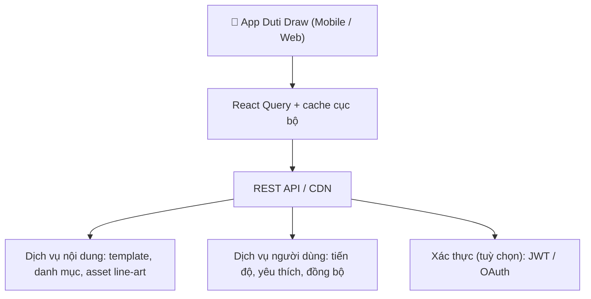

# Technical Design Document (TDD): Duti Draw

Tài liệu thiết kế chức năng (High Level + Technical Design) cho **Duti Draw** — ứng dụng **tô màu đa nền tảng** (Mobile, Web, Tablet). Trải nghiệm hướng tới trẻ em và người dùng thích phong cách fantasy: **thiên đường băng tuyết kết hợp kẹo ngọt**, sáng, vui tươi, giàu trí tưởng tượng.
Hệ thống âm thanh được thiết kế theo phong cách ambient fantasy nhẹ nhàng, với nhạc nền thư giãn và hiệu ứng tương tác tinh tế (brush, fill, color select), nhằm cung cấp phản hồi trực quan mà không gây phân tâm, đảm bảo trải nghiệm liền mạch và thân thiện với trẻ em.

**Tham chiếu hình ảnh giao diện / mood:** `docs/elsa-1.png` — cảnh fantasy mùa đông: băng trong, kẹo cây sọc đỏ trắng, marshmallow pastel, lâu đài băng, phấn màu rực rỡ và bông tuyết stylized.

---

## 1. Tổng quan hệ thống (System Overview)

### 1.1 Phạm vi sản phẩm
- **Duti Draw** tập trung vào: chọn tranh tô màu (template), tô trên canvas, lưu tiến độ, xuất / chia sẻ tác phẩm.
- **Đa nền tảng** một codebase: **Mobile (iOS & Android)**, **Web (React Native Web)**, tối ưu **Tablet** khi màn hình rộng (bố cục hai cột: danh sách + canvas).

### 1.2 Platform & Responsive
- **Mobile:** Thao tác một tay, Bottom Tab, vùng chạm lớn, ít bước để vào tô màu.
- **Tablet / iPad:** Split view: gallery bên trái, vùng vẽ bên phải (hoặc drawer gallery).
- **Web:** Sidebar hoặc header gọn; hỗ trợ chuột (fill / brush) và phím tắt cơ bản nếu cần.

### 1.3 Tech Stack
| Layer | Technology |
|-------|------------|
| **UI & Styling** | React Native, StyleSheet / theme tokens (mở rộng NativeWind nếu dự án áp dụng) |
| **State** | Zustand (session tô màu, cài đặt UI) |
| **API** | REST + Axios (module hóa theo domain) |
| **Data fetching** | TanStack React Query (gallery, metadata template, đồng bộ tiến độ) |
| **Form & validation** | React Hook Form + Zod (khi có màn đăng nhập / hồ sơ) |
| **Feedback** | Toast / modal nhẹ, phù hợp trẻ em |
| **Animation** | React Native Reanimated (chuyển cảnh màn, feedback chạm) |
| **Navigation** | Expo Router (file-based) |
| **Hình ảnh** | Expo Image / `react-native-fast-image` (tối ưu thumbnail gallery) |
| **Giám sát lỗi** | Sentry (tùy môi trường) |
| **CI/CD** | EAS Build / Submit |

### 1.4 React Native New Architecture
Áp dụng kiến trúc mới (JSI, Fabric, TurboModules) để canvas / gesture / animation mượt, giảm độ trễ khi vẽ và zoom.

---

## 2. Kiến trúc hệ thống (System Architecture)

Luồng dữ liệu tổng quan phù hợp ứng dụng tô màu (không bao gồm domain golf/booking/map cũ):



**CDN / static:** File PNG/SVG tranh, thumbnail, bundle metadata có thể phục vụ qua CDN để giảm tải API.

---

## 3. Cấu trúc mã nguồn (Source Code Architecture)

Dự án dùng **Expo Router** (file-based routing). **Không bắt buộc thư mục `src/`** — mã nguồn tổ chức quanh **`app/`** và các thư mục ở root (`components`, `hooks`, `constants`, …).

### 3.1 Cấu trúc đề xuất (Duti Draw)

```text
duti-draw/
├── app/                              # Expo Router
│   ├── _layout.tsx                   # Providers, theme, font
│   ├── (tabs)/                       # Tab chính
│   │   ├── _layout.tsx
│   │   ├── index.tsx                 # Home / nổi bật
│   │   ├── gallery.tsx               # Thư viện tranh theo danh mục
│   │   └── profile.tsx               # Tác phẩm đã lưu, cài đặt
│   ├── draw/
│   │   └── [id].tsx                  # Màn tô màu theo template id
│   └── modal.tsx                     # Modal: xác nhận, chia sẻ, about
│
├── components/
│   ├── ui/                           # Button, Card, Chip, Icon…
│   └── drawing/                      # Canvas wrapper, toolbar màu, undo/redo
│
├── features/
│   ├── gallery/                      # Lưới template, filter danh mục
│   └── coloring/                     # Logic fill, layer, export
│
├── services/
│   └── api/                          # apiClient, templatesAPI, progressAPI
├── stores/                           # Zustand: bộ cọ hiện tại, màu đang chọn
├── hooks/
├── constants/
│   └── theme.ts                      # Token màu / spacing theo Design System
├── assets/                           # Font, icon, texture UI (tùy)
├── docs/
│   └── elsa-1.png                    # Tham chiếu mood & palette
├── app.json
├── package.json
└── tsconfig.json
```

### 3.2 Quy ước Expo Router
| Trong `app/` | Ý nghĩa |
|--------------|--------|
| `_layout.tsx` | Layout nhóm (Stack, Tab). |
| `(tabs)/` | Nhóm route không thêm segment vào URL. |
| `draw/[id].tsx` | Dynamic route: mở một template cụ thể. |

### 3.3 Import
- Dùng alias **`@/*`** (theo `tsconfig`) trỏ về root: `@/components/...`, `@/services/...`.

---

## 4. Hệ thống thiết kế & giao diện (Design System)

Thiết kế **bám mood board** từ `docs/elsa-1.png`: *Magical Candy Winter* — băng trong, kẹo ngọt, marshmallow mềm, không khí tuyết sáng.

### 4.1 Khái niệm (Concept)
- **Cảm giác:** Vui, an toàn, “cổ tích mùa đông”, không gian thoáng, ánh sáng mềm.
- **Hình học UI:** Bo tròn lớn (marshmallow / viên kẹo); viền có thể gợi **sọc kẹo cây** (đỏ–trắng) cho thanh công cụ hoặc header phụ.
- **Trang trí:** Họa tiết nhẹ: bông tuyết stylized, sprinkle (chấm rắc) — **dùng tiết chế** để không làm rối vùng tô màu.

### 4.2 Bảng màu gợi ý (tokens)
| Token | Ý nghĩa | Gợi ý hex |
|-------|---------|-----------|
| `frost` | Nền chính, băng | `#A8D8EA` → `#E3F4F8` gradient nhẹ |
| `snow` | Nền phụ, thẻ | `#FFFFFF` |
| `candyPink` | Điểm nhấn, CTA phụ | `#FFB6C1` / `#FFC9E0` |
| `candyRed` | Nhấn mạnh, cảnh báo nhẹ | `#E84A5F` (tránh đỏ gắt full `#FF0000` trên diện rộng) |
| `iceDeep` | Text chính, icon đậm | `#2B4F6E` |
| `sprinkle` | Accent đa sắc (vàng, xanh lá, hồng) cho badge / streak |

Áp dụng **độ tương phản đủ** cho chữ trên nền pastel (WCAG nên kiểm tra trên Web).

### 4.3 Layout & thành phần
- **Flexbox** làm nền; `SafeAreaView` cho mobile.
- Wrapper: `ScreenContainer` (padding + safe area), vùng canvas full width trên mobile.
- Gallery: `FlatList` / grid responsive, thumbnail vuông bo góc, viền mỏng kiểu “thẻ kẹo”.

### 4.4 Asset & illustration
- Icon và minh họa phụ: phong cách **3D-friendly / vector mềm**, bão hòa vừa phải, thống nhất với mood **Elsa-like winter candy** (không sao chép nhân vật có bản quyền — chỉ **phong cách** và palette).

---

## 5. Module chức năng lõi (Core Features)

### 5.1 Thư viện tranh (Gallery)
- Danh sách template (line art) theo **danh mục** (động vật, cổ tích, ngày lễ…).
- Phân trang (cursor / offset), tìm kiếm đơn giản nếu backend hỗ trợ.
- **React Query:** cache danh sách + `staleTime` hợp lý để giảm gọi API.

### 5.2 Màn tô màu (Coloring)
- **Vùng vẽ:** Canvas dựa trên **SVG** (vùng fill theo path) hoặc **bitmap** + mask — lựa chọn chi tiết theo độ phức tạp asset và hiệu năng.
- **Công cụ tối thiểu:** chọn màu (palette + gần đây), tô vùng (fill), có thể mở rộng: undo/redo, zoom/pan.
- **Lưu cục bộ:** snapshot tiến độ (AsyncStorage / SQLite nếu cần) trước khi đồng bộ server.

### 5.3 Xuất & chia sẻ
- Export PNG/WebP từ view canvas (hoặc server render nếu có).
- Share sheet native (Expo Sharing) / download trên Web.

### 5.4 Tài khoản (tuỳ chọn)
- Chế độ khách: chỉ lưu máy.
- Đăng nhập: đồng bộ đa thiết bị, backup danh sách yêu thích — dùng JWT + refresh như mục 8.

---

## 6. Cấu trúc API (API Modularization)

### 6.1 Axios interceptors
- Gắn `Authorization` khi có token.
- Refresh token khi `401` (nếu dự án bật auth đầy đủ).

### 6.2 Ví dụ module
```typescript
import apiClient from './apiClient';

export const TemplatesAPI = {
  list: (params: { category?: string; cursor?: string }) =>
    apiClient.get('/templates', { params }),
  getById: (id: string) => apiClient.get(`/templates/${id}`),
};

export const ProgressAPI = {
  upsert: (templateId: string, payload: unknown) =>
    apiClient.put(`/progress/${templateId}`, payload),
};
```

---

## 7. Form, validation & thông báo

- Form đăng nhập / hồ sơ: **React Hook Form + Zod**.
- Toast / banner: **thành công** (nền sáng + viền/accent `candyPink` hoặc xanh băng nhạt), **lỗi** (đỏ dịu, không gắt), tránh cảnh báo gây sợ trẻ nhỏ.

---

## 8. Điều hướng (Navigation)

```text
Root
├── (tabs)
│   ├── Home
│   ├── Gallery
│   └── Profile / My art
├── draw/[id]          ← fullscreen hoặc stack riêng
└── Modals             ← chia sẻ, cài đặt, giới thiệu
```

---

## 9. Xác thực & lưu trữ token (khi bật đăng nhập)

- **Mobile:** `expo-secure-store` cho token.
- **Web:** ưu tiên cookie `httpOnly` nếu backend hỗ trợ; nếu không, giới hạn phạ vi token và CSP.
- **Zustand:** trạng thái phiên ngắn gọn (user, flags).

---

## 10. Chiến lược dữ liệu & offline

| Nhu cầu | Cách làm |
|---------|----------|
| Danh sách template | React Query cache + prefetch thumbnail |
| Đang tô dở | Lưu local (key theo `templateId`) |
| Offline | Hiển thị template đã cache; queue đồng bộ `progress` khi online |

Không cần **offline map**, **WebSocket vị trí**, hay **chat** cho phiên bản lõi của Duti Draw.

---

## 11. Hiệu năng (Performance)

- Gallery: `FlatList` với `windowSize`, kích thước ô cố định + `getItemLayout` nếu có thể.
- Giảm re-render canvas: tách toolbar và surface vẽ; `memo` cho ô màu.
- Ảnh: kích thước thumbnail phù hợp, định dạng WebP khi có.

---

## 12. Giám sát & CI/CD

- **Sentry:** crash JS, breadcrumb hành trình (bật theo env).
- **EAS:** build preview / production; lint + test (khi có) trên CI.

---

## 13. Bảo mật (Security)

| Mục tiêu | Cách tiếp cận |
|----------|----------------|
| API | HTTPS, rate limit phía server |
| Token | Hết hạn ngắn + refresh an toàn |
| Nội dung trẻ em | Tuân chính sách store; không thu thập dữ liệu nhạy cảm không cần thiết |

---

## 14. Chỉ tiêu hiệu năng (gợi ý)

| Metric | Mục tiêu gợi ý |
|--------|----------------|
| Cold start | < 2–3 s (tuỳ thiết bị) |
| Khung hình màn tô màu | Ổn định 60 fps khi gesture đơn giản |
| API gallery (danh sách đầu) | < 300 ms (mạng tốt, server gần) |

---

*Tài liệu Hệ thống (TDD): phiên bản theo **Duti Draw** — ứng dụng tô màu, theme **Fantasy Ice & Candy** thống nhất với tham chiếu `docs/elsa-1.png`, loại bỏ các phần không thuộc phạm vi (golf, bản đồ, booking, chat, streaming, BLE…).*
